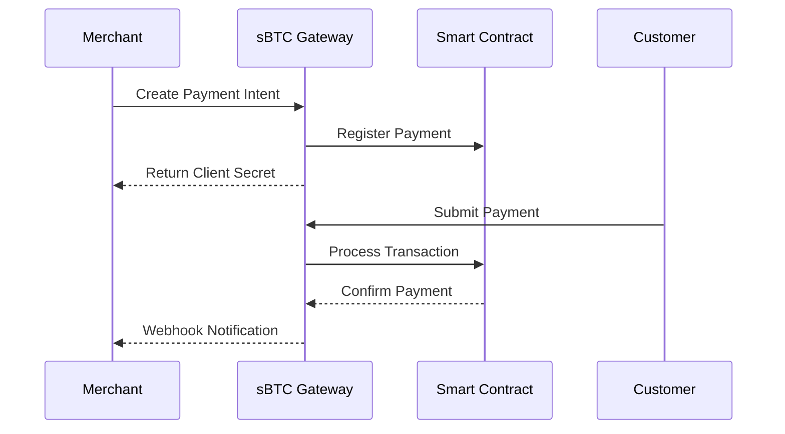

# ⚡ Quick Start Guide - sBTC Payment Gateway

Get started with Bitcoin payments in under 5 minutes!

## 🚀 Instant Demo

Try our live API right now - no setup required:

```bash
# Create a payment intent instantly
curl -X POST https://sbtc-payment-api-production.up.railway.app/api/payment-intents \
  -H "Authorization: Bearer pk_test_demo" \
  -H "Content-Type: application/json" \
  -d '{
    "amount": 50000,
    "description": "Quick Start Demo - 0.0005 BTC"
  }'
```

**Expected Response:**
```json
{
  "id": "pi_1234567890abcdef",
  "amount": 50000,
  "fee": 1250,
  "status": "requires_payment_method",
  "clientSecret": "pi_1234567890abcdef_secret_xyz",
  "createdAt": "2025-01-15T10:30:00Z",
  "expiresAt": "2025-01-16T10:30:00Z"
}
```

## 📱 Live Merchant Dashboard

Visit: **https://sbtcpaymentgateway-matt-glorys-projects.vercel.app**

- ✅ View real-time payment analytics
- ✅ Test payment flows interactively
- ✅ Explore merchant onboarding
- ✅ Try the payment widget

## 🔥 3-Line Integration

### JavaScript/Node.js
```javascript
// 1. Initialize the client
const sbtcpay = new SBTCPaymentGateway('pk_test_demo');

// 2. Create a payment
const payment = await sbtcpay.createPaymentIntent({
  amount: 50000, // 0.0005 BTC in satoshis
  description: 'Product Purchase'
});

// 3. Use the client secret in your frontend
console.log('Payment created:', payment.clientSecret);
```

### cURL
```bash
# 1. Create payment intent
PAYMENT=$(curl -s -X POST https://sbtc-payment-api-production.up.railway.app/api/payment-intents \
  -H "Authorization: Bearer pk_test_demo" \
  -H "Content-Type: application/json" \
  -d '{"amount": 50000, "description": "API Test"}')

# 2. Extract payment ID
PAYMENT_ID=$(echo $PAYMENT | jq -r '.id')

# 3. Check payment status
curl https://sbtc-payment-api-production.up.railway.app/api/payment-intents/$PAYMENT_ID
```

### React Component
```jsx
import { useState } from 'react';

function PaymentButton() {
  const [paymentId, setPaymentId] = useState(null);
  
  const createPayment = async () => {
    const response = await fetch('/api/payment-intents', {
      method: 'POST',
      headers: {
        'Authorization': 'Bearer pk_test_demo',
        'Content-Type': 'application/json'
      },
      body: JSON.stringify({
        amount: 50000,
        description: 'React Payment Test'
      })
    });
    
    const payment = await response.json();
    setPaymentId(payment.id);
  };
  
  return (
    <button onClick={createPayment}>
      Pay 0.0005 BTC
    </button>
  );
}
```

## 🛠️ API Endpoints

### Base URL
```
Production: https://sbtc-payment-api-production.up.railway.app
```

### Essential Endpoints

| Method | Endpoint | Description |
|--------|----------|-------------|
| `GET` | `/health` | System status |
| `POST` | `/api/payment-intents` | Create payment |
| `GET` | `/api/payment-intents/{id}` | Get payment details |
| `POST` | `/api/payment-intents/{id}/confirm` | Confirm payment |
| `POST` | `/api/merchants/register` | Register merchant |
| `GET` | `/api/merchants/dashboard` | Get dashboard data |

### Demo API Keys
```
pk_test_demo
pk_test_your_key
pk_test_123
```

## 📊 Real-time Testing

### 1. Check System Health
```bash
curl https://sbtc-payment-api-production.up.railway.app/health
```

### 2. Register as Demo Merchant
```bash
curl -X POST https://sbtc-payment-api-production.up.railway.app/api/merchants/register \
  -H "Content-Type: application/json" \
  -d '{
    "businessName": "Quick Start Demo Store",
    "email": "demo@example.com",
    "stacksAddress": "ST1DEMO123ADDRESS456EXAMPLE789"
  }'
```

### 3. Get Dashboard Analytics
```bash
curl https://sbtc-payment-api-production.up.railway.app/api/merchants/dashboard \
  -H "Authorization: Bearer pk_test_demo"
```

## 🎯 Payment Flow



## 🔧 Error Handling

All API responses use consistent error formatting:

```json
{
  "error": "Descriptive error message",
  "code": "SPECIFIC_ERROR_CODE",
  "hint": "How to fix this error",
  "requestId": "unique-request-identifier"
}
```

Common error codes:
- `MISSING_API_KEY` - Include Authorization header
- `INVALID_AMOUNT` - Amount must be positive integer
- `PAYMENT_EXPIRED` - Payment window exceeded
- `RATE_LIMIT_EXCEEDED` - Too many requests

## 📚 Next Steps

1. **Explore the Dashboard**: https://sbtcpaymentgateway-matt-glorys-projects.vercel.app
2. **Read Full Documentation**: [/docs/API.md](./docs/API.md)
3. **Review Business Plan**: [/docs/BUSINESS_PLAN.md](./docs/BUSINESS_PLAN.md)
4. **Check Competition Entry**: [/STACKS_COMPETITION.md](./STACKS_COMPETITION.md)

## 💬 Need Help?

- **GitHub Issues**: https://github.com/mattglory/sbtc-payment-gateway/issues
- **Email**: mattglory14@gmail.com
- **Live Demo Problems**: Check network status at API health endpoint

---

**Start accepting Bitcoin payments in minutes, not weeks!**

*Built for developers, designed for merchants, optimized for Bitcoin.*