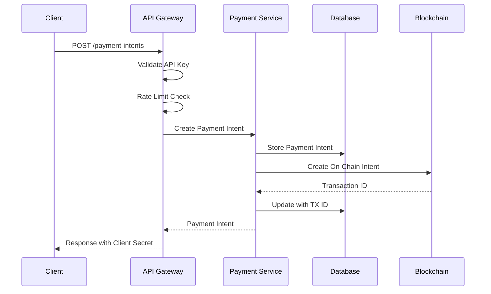
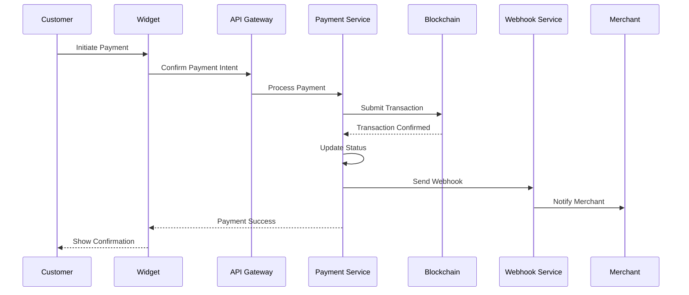

# sBTC Payment Gateway - Technical Architecture

## 🏗️ System Overview

The sBTC Payment Gateway is a comprehensive payment infrastructure built on the Stacks blockchain, designed to make Bitcoin payments as simple as traditional online payments. The system follows a microservices architecture with clear separation of concerns.

```
┌─────────────────────────────────────────────────────────────────────┐
│                        Client Applications                          │
├─────────────────┬─────────────────┬─────────────────┬───────────────┤
│  Merchant       │   Developer     │   End User      │   Mobile      │
│  Dashboard      │   Portal        │   Widget        │   Apps        │
└─────────────────┴─────────────────┴─────────────────┴───────────────┘
                                │
                    ┌───────────────────────┐
                    │    Load Balancer      │
                    │   (Nginx/Cloudflare)  │
                    └───────────────────────┘
                                │
┌─────────────────────────────────────────────────────────────────────┐
│                        API Gateway Layer                           │
│  ┌─────────────────────────────────────────────────────────────────┐│
│  │  • Authentication & Authorization                               ││
│  │  • Rate Limiting & DDoS Protection                              ││
│  │  • Request/Response Logging                                     ││
│  │  • API Versioning & Deprecation                                 ││
│  │  • Input Validation & Sanitization                              ││
│  └─────────────────────────────────────────────────────────────────┘│
└─────────────────────────────────────────────────────────────────────┘
                                │
┌─────────────────────────────────────────────────────────────────────┐
│                      Business Logic Layer                          │
│  ┌─────────────┬─────────────┬─────────────┬─────────────────────┐  │
│  │  Payment    │  Merchant   │  Analytics  │     Webhook         │  │
│  │  Service    │  Service    │  Service    │     Service         │  │
│  └─────────────┴─────────────┴─────────────┴─────────────────────┘  │
└─────────────────────────────────────────────────────────────────────┘
                                │
┌─────────────────────────────────────────────────────────────────────┐
│                       Data Layer                                   │
│  ┌─────────────┬─────────────┬─────────────┬─────────────────────┐  │
│  │ PostgreSQL  │    Redis    │  MongoDB    │    File Storage     │  │
│  │(Relational) │  (Cache)    │(Analytics)  │    (Logs/Assets)    │  │
│  └─────────────┴─────────────┴─────────────┴─────────────────────┘  │
└─────────────────────────────────────────────────────────────────────┘
                                │
┌─────────────────────────────────────────────────────────────────────┐
│                     Blockchain Layer                               │
│  ┌─────────────────────────────────────────────────────────────────┐│
│  │                 Stacks Blockchain                               ││
│  │  • Smart Contract (Clarity)                                     ││
│  │  • sBTC Token Management                                        ││
│  │  • Transaction Processing                                       ││
│  │  • Event Monitoring                                             ││
│  │  • Network Communication                                        ││
│  └─────────────────────────────────────────────────────────────────┘│
└─────────────────────────────────────────────────────────────────────┘
```

## 🎯 Design Principles

### 1. Scalability First
- Horizontal scaling capability
- Stateless service design
- Database sharding support
- CDN integration for global performance

### 2. Security by Design
- Defense in depth strategy
- Zero-trust architecture
- End-to-end encryption
- Regular security audits

### 3. Developer Experience
- Stripe-compatible API design
- Comprehensive SDKs and documentation
- Sandbox environment for testing
- Clear error messages and debugging tools

### 4. Reliability
- 99.9% uptime SLA
- Graceful degradation
- Circuit breaker patterns
- Comprehensive monitoring and alerting

## 📦 Component Architecture

### API Gateway Layer

The API Gateway serves as the single entry point for all client requests, providing essential cross-cutting concerns:

```javascript
// API Gateway Features
{
  "authentication": "JWT + API Key based",
  "rateLimit": "Redis-based sliding window",
  "validation": "JSON Schema validation",
  "logging": "Structured logging with correlation IDs",
  "monitoring": "Prometheus metrics collection",
  "caching": "Redis-based response caching",
  "compression": "Gzip/Brotli compression",
  "cors": "Configurable CORS policies"
}
```

#### Key Responsibilities:
- **Authentication & Authorization**: Validate API keys and JWT tokens
- **Rate Limiting**: Prevent abuse and ensure fair usage
- **Request Validation**: Validate input data against schemas
- **Response Transformation**: Format responses consistently
- **Error Handling**: Provide meaningful error messages
- **Metrics Collection**: Track API usage and performance

### Business Logic Layer

#### Payment Service
Handles all payment-related operations:

```typescript
interface PaymentService {
  // Core payment operations
  createPaymentIntent(data: PaymentIntentRequest): Promise<PaymentIntent>
  retrievePaymentIntent(id: string): Promise<PaymentIntent>
  confirmPayment(id: string, confirmation: PaymentConfirmation): Promise<PaymentIntent>
  cancelPayment(id: string, reason?: string): Promise<PaymentIntent>
  
  // Payment lifecycle management
  processPayment(intent: PaymentIntent): Promise<ProcessingResult>
  validatePayment(transactionId: string): Promise<ValidationResult>
  handleExpiredPayments(): Promise<void>
  
  // Fee and settlement
  calculateFees(amount: number, merchantTier: string): FeeCalculation
  processSettlement(merchantId: string, period: DateRange): Promise<Settlement>
}
```

**Key Features:**
- Payment intent lifecycle management
- Real-time payment status tracking
- Automated fee calculation and distribution
- Payment expiration handling
- Settlement processing

#### Merchant Service
Manages merchant accounts and business logic:

```typescript
interface MerchantService {
  // Merchant management
  registerMerchant(data: MerchantRegistration): Promise<Merchant>
  updateMerchant(id: string, data: MerchantUpdate): Promise<Merchant>
  getMerchant(id: string): Promise<Merchant>
  
  // API key management
  generateApiKeys(merchantId: string): Promise<ApiKeyPair>
  rotateApiKeys(merchantId: string): Promise<ApiKeyPair>
  validateApiKey(apiKey: string): Promise<MerchantAuth>
  
  // Analytics and reporting
  getDashboardData(merchantId: string): Promise<DashboardData>
  getPaymentHistory(merchantId: string, filters: PaymentFilters): Promise<Payment[]>
  generateReport(merchantId: string, type: ReportType): Promise<Report>
}
```

**Key Features:**
- Merchant registration and KYC
- API key generation and management
- Dashboard analytics
- Business settings configuration
- Compliance monitoring

#### Analytics Service
Provides business intelligence and reporting:

```typescript
interface AnalyticsService {
  // Real-time metrics
  getRealtimeMetrics(): Promise<RealtimeMetrics>
  getSystemHealth(): Promise<HealthMetrics>
  
  // Payment analytics
  getPaymentAnalytics(filters: AnalyticsFilters): Promise<PaymentAnalytics>
  getConversionMetrics(merchantId?: string): Promise<ConversionMetrics>
  getFraudDetectionMetrics(): Promise<FraudMetrics>
  
  // Business intelligence
  getRevenueProjections(merchantId: string): Promise<RevenueProjection[]>
  getCustomerInsights(merchantId: string): Promise<CustomerInsights>
  getBenchmarkData(merchantId: string): Promise<BenchmarkData>
}
```

**Key Features:**
- Real-time payment tracking
- Revenue analytics and projections
- Customer behavior analysis
- Fraud detection and prevention
- Performance benchmarking

#### Webhook Service
Manages real-time event notifications:

```typescript
interface WebhookService {
  // Webhook management
  registerWebhook(merchantId: string, config: WebhookConfig): Promise<Webhook>
  updateWebhook(id: string, config: WebhookConfig): Promise<Webhook>
  deleteWebhook(id: string): Promise<void>
  
  // Event delivery
  sendEvent(event: WebhookEvent): Promise<DeliveryResult>
  retryFailedDelivery(eventId: string): Promise<DeliveryResult>
  getDeliveryStatus(eventId: string): Promise<DeliveryStatus>
  
  // Security and validation
  generateSignature(payload: string, secret: string): string
  validateSignature(payload: string, signature: string, secret: string): boolean
}
```

**Key Features:**
- Event-driven architecture
- Reliable event delivery with retries
- Webhook signature verification
- Delivery status tracking
- Rate limiting and throttling

### Data Layer

#### Primary Database (PostgreSQL)
Stores core business data with ACID guarantees:

```sql
-- Core Tables Structure
TABLE merchants (
  id UUID PRIMARY KEY,
  business_name VARCHAR(255) NOT NULL,
  email VARCHAR(255) UNIQUE NOT NULL,
  stacks_address VARCHAR(64) NOT NULL,
  api_key_hash VARCHAR(255) NOT NULL,
  status merchant_status DEFAULT 'active',
  created_at TIMESTAMP WITH TIME ZONE DEFAULT NOW(),
  updated_at TIMESTAMP WITH TIME ZONE DEFAULT NOW()
);

TABLE payment_intents (
  id UUID PRIMARY KEY,
  merchant_id UUID REFERENCES merchants(id),
  amount BIGINT NOT NULL,
  fee BIGINT NOT NULL,
  currency VARCHAR(10) DEFAULT 'BTC',
  description TEXT,
  status payment_status DEFAULT 'requires_payment_method',
  customer_address VARCHAR(64),
  transaction_id VARCHAR(64),
  client_secret VARCHAR(255) NOT NULL,
  metadata JSONB,
  expires_at TIMESTAMP WITH TIME ZONE,
  created_at TIMESTAMP WITH TIME ZONE DEFAULT NOW(),
  updated_at TIMESTAMP WITH TIME ZONE DEFAULT NOW()
);

TABLE webhook_endpoints (
  id UUID PRIMARY KEY,
  merchant_id UUID REFERENCES merchants(id),
  url VARCHAR(2048) NOT NULL,
  events VARCHAR(50)[] NOT NULL,
  secret VARCHAR(255) NOT NULL,
  status webhook_status DEFAULT 'active',
  created_at TIMESTAMP WITH TIME ZONE DEFAULT NOW()
);
```

#### Cache Layer (Redis)
Provides high-performance caching and session storage:

```redis
# Cache Strategies
payment_intent:{id} -> PaymentIntent JSON (TTL: 30 minutes)
merchant_auth:{api_key_hash} -> Merchant ID (TTL: 1 hour)
rate_limit:{ip}:{endpoint} -> Request count (TTL: Window size)
session:{session_id} -> Session data (TTL: 24 hours)

# Real-time data
metrics:realtime -> System metrics JSON (TTL: 30 seconds)
payment_status:{payment_id} -> Status updates (TTL: 1 hour)
```

#### Analytics Database (MongoDB)
Stores analytical data and large datasets:

```javascript
// Collections Schema
{
  // Payment events for analytics
  payment_events: {
    _id: ObjectId,
    payment_id: String,
    merchant_id: String,
    event_type: String,
    amount: Number,
    timestamp: Date,
    metadata: Object,
    ip_address: String,
    user_agent: String
  },
  
  // Daily aggregated metrics
  daily_metrics: {
    _id: ObjectId,
    date: Date,
    merchant_id: String,
    total_volume: Number,
    transaction_count: Number,
    successful_payments: Number,
    failed_payments: Number,
    average_amount: Number
  }
}
```

### Blockchain Layer

#### Smart Contract Architecture
The Clarity smart contract provides the foundation for payment processing:

```clarity
;; Core Contract Functions
(define-public (register-merchant (merchant-data (tuple (name (string-ascii 100)) 
                                                        (email (string-ascii 100))))))

(define-public (create-payment-intent (payment-id (string-ascii 36))
                                      (amount uint)
                                      (description (optional (string-utf8 200)))))

(define-public (process-payment (payment-id (string-ascii 36))
                               (customer principal)))

(define-public (distribute-fees (payment-id (string-ascii 36))))

;; Contract Data
(define-map merchants principal 
  (tuple (name (string-ascii 100))
         (email (string-ascii 100))
         (active bool)
         (total-processed uint)
         (created-at uint)))

(define-map payment-intents (string-ascii 36)
  (tuple (merchant principal)
         (amount uint)
         (fee uint)
         (status (string-ascii 20))
         (customer (optional principal))
         (created-at uint)
         (expires-at uint)))
```

**Smart Contract Features:**
- Merchant registration and verification
- Payment intent creation and management
- Automated fee calculation and distribution
- Event emission for off-chain monitoring
- Access control and security measures

#### Blockchain Integration Service
Handles communication with the Stacks blockchain:

```typescript
interface BlockchainService {
  // Contract interaction
  deployContract(contractCode: string): Promise<DeploymentResult>
  callContractFunction(contract: string, method: string, args: any[]): Promise<TransactionResult>
  readContractData(contract: string, dataVar: string): Promise<any>
  
  // Transaction monitoring
  monitorTransaction(txId: string): Promise<TransactionStatus>
  getTransactionEvents(txId: string): Promise<Event[]>
  subscribeToEvents(contractAddress: string, eventTypes: string[]): Promise<Subscription>
  
  // Network management
  getNetworkInfo(): Promise<NetworkInfo>
  estimateTransactionFee(transaction: Transaction): Promise<FeeEstimate>
  broadcastTransaction(transaction: SignedTransaction): Promise<BroadcastResult>
}
```

## 🔄 Data Flow

### Payment Creation Flow



### Payment Processing Flow



## 🚀 Performance Optimization

### Caching Strategy

1. **Application Layer Caching**
   - Redis for session storage and rate limiting
   - In-memory caching for frequently accessed data
   - Response caching for static API responses

2. **Database Query Optimization**
   - Connection pooling with pgBouncer
   - Read replicas for analytics queries
   - Proper indexing strategy
   - Query performance monitoring

3. **CDN Integration**
   - Static asset delivery via CDN
   - API response caching at edge locations
   - Geographic distribution for global users

### Scalability Patterns

1. **Horizontal Scaling**
   - Stateless application design
   - Load balancing across multiple instances
   - Database sharding for large datasets

2. **Asynchronous Processing**
   - Message queues for background tasks
   - Event-driven architecture
   - Batch processing for analytics

3. **Microservices Architecture**
   - Independent service scaling
   - Service mesh for communication
   - Circuit breaker patterns

## 🔒 Security Architecture

### Authentication & Authorization

```typescript
// Multi-layer security approach
interface SecurityLayer {
  // API Key Authentication
  apiKeyAuth: {
    keyFormat: "pk_{env}_{random}"
    encryption: "AES-256-GCM"
    rotation: "90 days"
    rateLimit: "per merchant basis"
  }
  
  // JWT for dashboard access
  jwtAuth: {
    algorithm: "RS256"
    expiration: "1 hour"
    refreshToken: "7 days"
    claims: ["merchant_id", "permissions"]
  }
  
  // Request signing for sensitive operations
  requestSigning: {
    algorithm: "HMAC-SHA256"
    timestamp: "5 minute window"
    nonce: "UUID v4"
  }
}
```

### Data Protection

1. **Encryption**
   - TLS 1.3 for data in transit
   - AES-256 encryption for data at rest
   - Field-level encryption for sensitive data
   - Key rotation every 90 days

2. **Access Control**
   - Role-based access control (RBAC)
   - Principle of least privilege
   - API key scoping and permissions
   - IP whitelisting for administrative access

3. **Compliance**
   - PCI DSS Level 1 compliance (roadmap)
   - GDPR compliance for data privacy
   - SOC 2 Type II certification (roadmap)
   - Regular security audits

### Fraud Prevention

```typescript
interface FraudDetection {
  // Real-time scoring
  riskScoring: {
    ipReputation: "Check against known fraud databases"
    deviceFingerprinting: "Browser and device characteristics"
    behaviorAnalysis: "Transaction patterns and timing"
    velocityChecks: "Transaction frequency limits"
  }
  
  // Machine learning models
  mlModels: {
    anomalyDetection: "Unsupervised learning for outliers"
    patternRecognition: "Supervised models for known fraud"
    riskPrediction: "Predictive scoring for new transactions"
  }
  
  // Automatic actions
  autoActions: {
    blockSuspicious: "Automatically block high-risk transactions"
    requireVerification: "Request additional verification"
    adjustLimits: "Dynamic transaction limits"
    alertMerchants: "Real-time fraud alerts"
  }
}
```

## 📊 Monitoring & Observability

### Application Performance Monitoring

```yaml
# Monitoring Stack
metrics:
  collection: Prometheus
  visualization: Grafana
  alerting: AlertManager
  
logging:
  aggregation: ELK Stack (Elasticsearch, Logstash, Kibana)
  structured: JSON format with correlation IDs
  retention: 90 days for application logs
  
tracing:
  distributed: Jaeger for request tracing
  sampling: 10% sample rate in production
  correlation: Request IDs across all services
  
uptime:
  external: Pingdom/StatusPage
  internal: Custom health checks
  sla: 99.9% uptime target
```

### Key Metrics

```typescript
interface MonitoringMetrics {
  // Business metrics
  business: {
    transactionVolume: "Total payment volume processed"
    transactionCount: "Number of successful transactions"
    conversionRate: "Payment success rate"
    averageAmount: "Average transaction amount"
    merchantGrowth: "New merchant registrations"
  }
  
  // Technical metrics
  technical: {
    apiLatency: "API response times (P50, P95, P99)"
    errorRate: "4xx/5xx error rates by endpoint"
    throughput: "Requests per second"
    databasePerformance: "Query execution times"
    blockchainLatency: "Transaction confirmation times"
  }
  
  // Infrastructure metrics
  infrastructure: {
    cpuUtilization: "Server CPU usage"
    memoryUsage: "Memory consumption"
    diskSpace: "Storage utilization"
    networkLatency: "Network round-trip times"
    queueDepth: "Background job queue sizes"
  }
}
```

### Alerting Strategy

```yaml
# Alert Categories
critical:
  - API error rate > 5%
  - Database connection failures
  - Payment processing failures
  - Security incidents
  
warning:
  - API latency > 1000ms
  - High memory usage (>80%)
  - Queue depth > 1000 jobs
  - Low disk space (<20%)
  
info:
  - New merchant registrations
  - Large transactions (>$10,000)
  - API usage spikes
  - System deployments
```

## 🌐 Deployment Architecture

### Production Environment

```yaml
# AWS/GCP Production Setup
compute:
  api_servers:
    type: "Auto Scaling Group"
    min_capacity: 3
    max_capacity: 20
    instance_type: "c5.xlarge"
    
  background_workers:
    type: "ECS Fargate"
    min_capacity: 2
    max_capacity: 10
    cpu: "2 vCPU"
    memory: "4 GB"

database:
  primary:
    type: "RDS PostgreSQL"
    instance_class: "db.r5.2xlarge"
    multi_az: true
    backup_retention: "30 days"
    
  cache:
    type: "ElastiCache Redis"
    node_type: "cache.r5.xlarge"
    cluster_mode: true
    
  analytics:
    type: "MongoDB Atlas"
    tier: "M30"
    replication: "3 member replica set"

networking:
  load_balancer:
    type: "Application Load Balancer"
    ssl_termination: true
    health_checks: "/health"
    
  cdn:
    provider: "CloudFront/CloudFlare"
    caching: "Static assets and API responses"
    geographic_distribution: "Global edge locations"
```

### CI/CD Pipeline

```yaml
# GitHub Actions Workflow
stages:
  - name: "Test"
    steps:
      - unit_tests: "Jest test suite"
      - integration_tests: "API endpoint testing"
      - security_scan: "OWASP ZAP security testing"
      - performance_test: "Load testing with Artillery"
      
  - name: "Build"
    steps:
      - docker_build: "Multi-stage Docker builds"
      - image_scan: "Container vulnerability scanning"
      - push_registry: "Push to ECR/Docker Hub"
      
  - name: "Deploy"
    steps:
      - deploy_staging: "Automated staging deployment"
      - smoke_tests: "Post-deployment verification"
      - deploy_production: "Blue-green production deployment"
      - health_check: "Production health verification"
```

## 🔄 Disaster Recovery

### Backup Strategy

```yaml
backup_strategy:
  database:
    frequency: "Continuous WAL archiving"
    point_in_time_recovery: "7 days"
    cross_region_replication: true
    
  application:
    docker_images: "Stored in multiple registries"
    configuration: "Version controlled in Git"
    secrets: "Encrypted in AWS Secrets Manager"
    
  monitoring:
    backup_verification: "Daily backup restoration tests"
    recovery_time_objective: "4 hours"
    recovery_point_objective: "15 minutes"
```

### High Availability

```yaml
availability_design:
  multi_region: "Active-passive setup across regions"
  auto_failover: "Automatic failover for database and cache"
  health_monitoring: "Continuous health checks"
  graceful_degradation: "Reduced functionality during outages"
  
failover_procedures:
  database: "RDS Multi-AZ automatic failover"
  application: "Auto Scaling Group health checks"
  cache: "ElastiCache automatic node replacement"
  dns: "Route 53 health check failover"
```

---

This architecture is designed to scale from startup to enterprise, providing the foundation for a world-class Bitcoin payment infrastructure. The modular design allows for incremental improvements and easy maintenance while ensuring security, performance, and reliability at every layer.